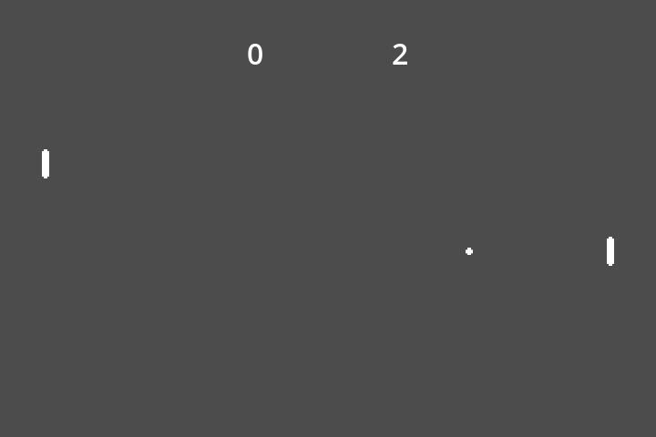

# Pong
A very basic Pong game with an AI-opponent that cannot lose.

## Resources
- https://www.youtube.com/watch?v=xlz4g31MhN8
- https://docs.godotengine.org/en/4.4/getting_started/first_2d_game/index.html
- https://github.com/godotengine/godot-demo-projects/tree/master/2d/pong

Sound effects made using: https://sfxr.me/

## Screenshots

